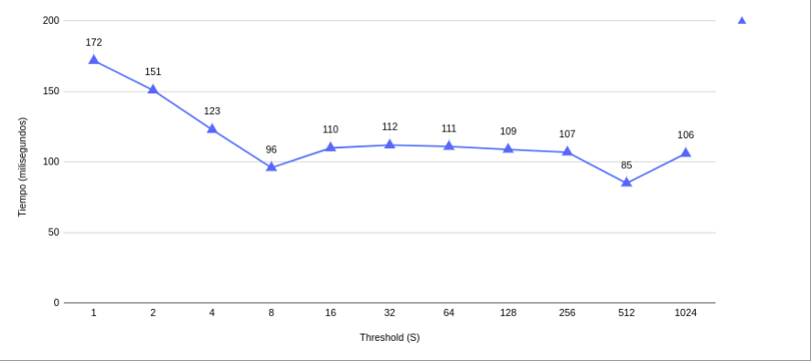

# Manejo de estructuras que usan locks #

## Fuentes de consulta ##
1. Material de clase (Videos y diapostivas).
2. Texto guía [**Operating Systems: Three Easy Pieces**](http://pages.cs.wisc.edu/~remzi/OSTEP/). Para desarrollar este laboratorio se recomienda tener a la mano el capítulo [Lock-based Concurrent Data Structures](http://pages.cs.wisc.edu/~remzi/OSTEP/threads-locks-usage.pdf)

## Ejercicios ##

1. Consulte el uso de la función ```gettimeofday``` para medir el tiempo de ejecución de un programa
   * ¿Cómo se utiliza esta función (muestre un ejemplo)?

   R:// por medio de la librería ```sys/time``` podemos tener acceso a la función ```gettimeofday``` el ejemplo de uso está en el archivo ```p1.c```. Con la librería tenemos disponible una estructura llamada ```timeval``` que tiene 2 campos: ```tv_sec``` y ```tv_usec``` que miden respectivamente los segundos y microsegundos transcurridos desde el 1 de enero de 1970. Esta función funciona a modo de timestamp conocido en otros lenguajes (ver p1.c).

   * ¿Cuál es el intervalo de tiempo más corto que se puede medir con esta función?

   R:// Según la documentación la función puede medir tiempo en el orden de microsegundos (0,001 milisegundos).

2. Consulte cuantas CPUs hay disponibles en el sistema que usted está utilizando. (Pista use el comando lscpu)

   R:// El computador sobre el que se desarrolló la práctica cuenta con 4 CPUs (ver captura en pantallazos/p2.png).

3. Desarrolle un programa que utilice un contador concurrente simple. Mida cuánto tiempo lleva incrementar el contador muchas veces a medida que aumenta el número de hilos (1, 2, 4, 8 y 16). Para tal fin, siga las instrucciones que aparecen en el directorio [preciso](./preciso). Una vez complete los pasos continue con el tercer punto.

4. Desarrolle una versión del contador aproximado (*sloppy counter*) y mida su desempeño a medida que se varía el número de hilos. En este caso, solo maneje un umbral de S = 1024 variando el número de hilos (1, 2, 4, 8 y 16). Las intrucciones para ello se encuentran en el directorio [aproximado](./aproximado).

5. Grafique los resultados obtenidos de las pruebas recopiladas (en las tablas) para el **número de hilos .vs. el tiempo (en segundos)**, estas siguen la tendencia de la figura **29.5** del libro (la cual se muestra a continuación):


   * ¿Los valores que usted obtuvo siguen una tendencia como la que se muestra en el texto guía (mostrada anteriormente)?
   * ¿Cuántas CPUs hay disponibles en el sistema que usted está utilizando?  
   * ¿Este número afecta de alguna manera sus mediciones?

### RESULTADOS ###


* Para el caso del contador secuencial sí que es cierto que siguen la tendencia de incrementar el tiempo a medida que aumenta el número de hilos, sin embargo para el caso del contador aproximado no se evidencia el comportamiento del libro, por el contrario sigue teniendo una tendencia a incrementar el tiempo de ejecución, lo que si se aprecia es que es sustancialmente más rápido que el contador preciso.

* Actualmente hay 4 CPUs disponibles en el sistema con que se realizó el laboratorio.

* EL libro guía basa sus experimentos en una configuración de CPUs, similar, podría creer que las variaciones en los resultados se deben a la implementación de los algoritmos con los que se haya realizado la prueba. En este momento no se cuenta con información concluyente sobre la diferencia en ambos resultados.

6. Mejore el archivo [test_aproximate_mejorado_counter.c](./aproximado_mejorado/test_aproximate_mejorado_counter.c) (el cual se encuentra en el directorio [aproximado_mejorado](./aproximado_mejorado)) de tal modo que, además de permitir modificar el numero de hilos y el valor máximo del contador a emplear, permita modificar también el umbral o factor de apromación (S), para esto se puede basar en el ejercicio 3. De este modo los parametros serán:
   * Umbral: ```APPROXIMATION_FACTOR```
   * Valor máximo del contador: ```MAXCNT```
   * Número de hilos que serán lanzados: ```NUMTHREADS```
   
Según lo anterior, la forma de pasar argumentos a la aplicación será la siguiente, una vez esté completamente terminada:  

```
./NOMBRE_EJECUTABLE <APPROXIMATION_FACTOR> <MAXCNT> <NUMTHREADS>
```

Luego, ejecute varias veces la aplicación dejando constante el valor máximo del contador en 10000000 y el número de hilos en 4, pero cambiando el valor del umbral a los siguientes valores: 1, 2, 4, 8, 16, 32, 64, 128, 256, 512 y 1024. ¿La gráfica sigue una tendencia similar a la mostrada en la figura **29.6** del texto guía (la cual se muestra a continuación)?


### Resultados ### 

Las capturas con los resultados se encuentran en la carpeta ```pantallazos/aproximado_mejorado```



Como se observa en la gŕafica, la tendencia en el tiempo a medida que aumenta el número del treshold parace no disminuir en la misma medida que se expone en el libro guía, sin embargo al principio del experimento se observa cierta similitud pero luego dicha tendencia es interrumpida con un aumento del tiempo.
